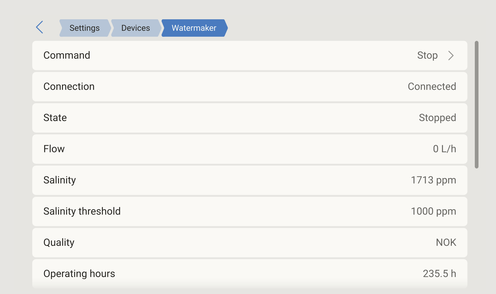
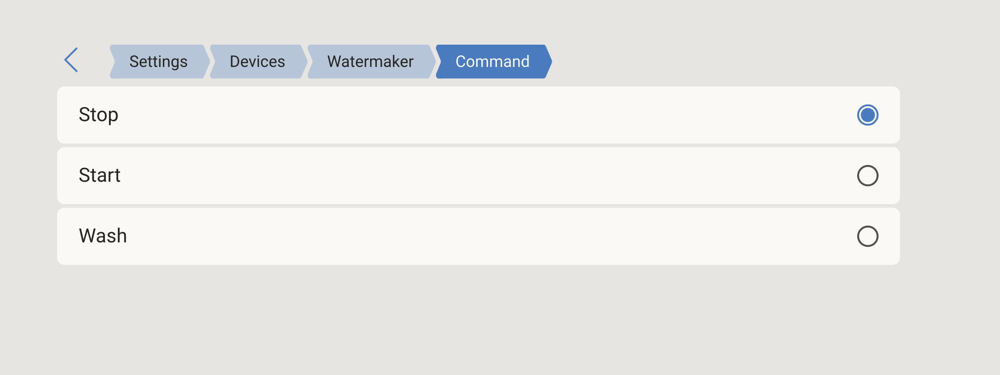
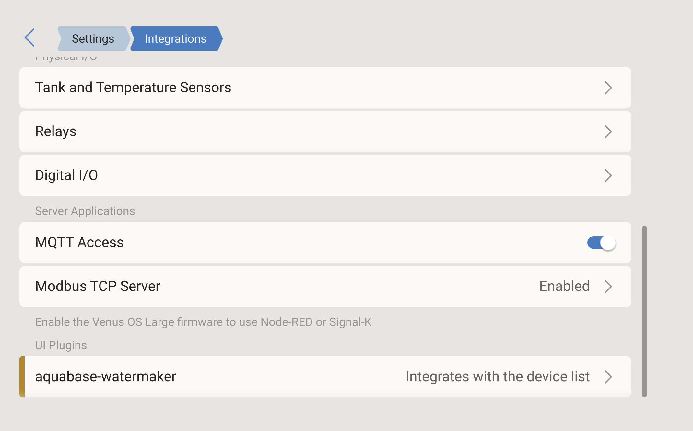
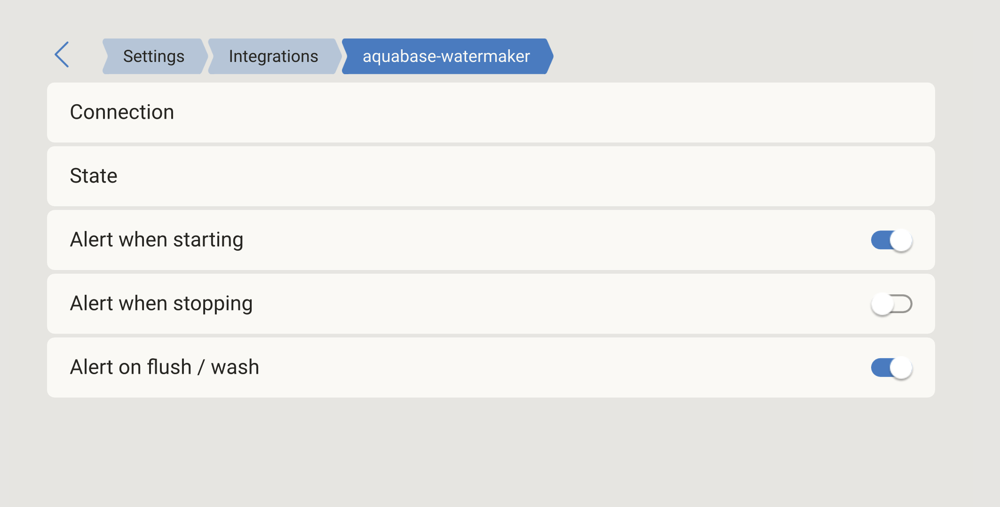
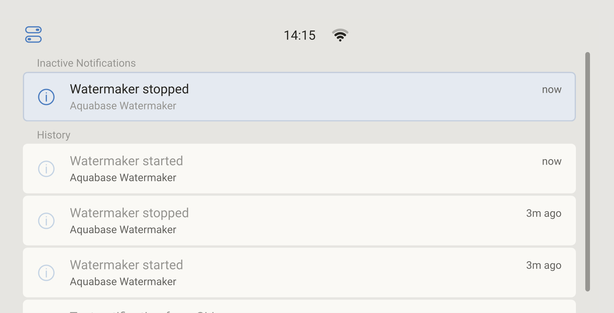

# Aquabase-watermaker

Venus OS dbus bridge for **Aquabase / SLCE Watermakers** (FIJI, ARUBA, SOROYA, BW
families) over BLE. Publishes `com.victronenergy.watermaker.aquabase` so the
unit shows up on the GX touchscreen alongside your other devices.

Reverse-engineered from the official Aquabase 0.0.1 Android app and validated
against a live FIJI Premium 65.

## Status

- ✅ Read-only telemetry: state, operating hours, salinity, salinity threshold,
  flow rate, water-quality (OK/NOK), model, serial, commission date,
  most-recent event.
- ✅ Auto-reconnect with configurable retry interval.
- ✅ Toggleable alerts on start / stop / wash, surfaced as
  `/Alarms/{StartEvent,StopEvent,WashEvent}` on the bridge's dbus service
  *and* injected onto `com.victronenergy.platform/Notifications/Inject` so
  they appear on the GX **Notifications** tab.
- ✅ Writable `/Mode` (Stop / Start / Wash) command rendered as a
  three-option picker on the device page.
- ✅ Custom QML page on the **Cerbo GX** touchscreen via the official `gui-v2`
  plugin system (Settings → Devices → Watermaker, plus
  Settings → Integrations → UI Plugins → aquabase-watermaker).

## Screenshots

The bridge surfaces the watermaker on the GX touchscreen (and the LAN
Remote Console) at three different routes:

| | |
|---|---|
| **Settings → Devices → Watermaker** — read-only telemetry plus the writable command at the top.  | **Command picker** — Stop / Start / Wash, sends `10 00`, `10 01` or `10 02` over BLE.  |
| **Settings → Integrations → UI Plugins** — `aquabase-watermaker` registered as a device-list integration.  | **Settings → Integrations → aquabase-watermaker** — per-event alert toggles wired to the GX Notifications tab.  |

State-transition alerts land on the **Notifications** tab (toggleable per
event, see [Alerts](#alerts)):



## Hardware support

This package targets a **Cerbo GX (or Cerbo GX MK2 / Ekrano GX)**, which has a
working USB BT stack that `bleak` can drive. The bridge has been validated on
a Cerbo GX running Venus OS v3.72 with `gui-v2` v1.2.38.

A **Raspberry Pi running Venus OS** is **not** supported out of the box.
Although the Pi 4 has a BT chip, Venus's U-Boot pipeline does not honour
the `miniuart-bt` device-tree overlay that would expose it to bluez —
`/sys/class/bluetooth/` ends up empty. Plugging in any cheap USB BT dongle
(CSR8510, RTL8761, BCM20702, etc.) sidesteps the issue and the same `setup`
script will work on a Pi too; the legacy `gui` patch path is still wired up
in `setup install` and will be applied automatically when `/service/gui`
exists. Just don't expect onboard BT to work without a dongle.

## Requirements

- Cerbo GX or other GX device with `hci0` available (verify with `hciconfig`).
- Venus OS 3.5x or later (anything with `python3-dbus` and `python3-dbus-fast`
  pre-installed; check with `opkg list-installed | grep -E 'dbus|dbus-fast'`).
- The `gui-v2` plugin manifest in `plugin/aquabase-watermaker.json` is
  pre-built and lands automatically; you only need Qt6 + Emscripten if you
  want to *modify* the QML pages — see [Building the plugin](#building-the-plugin).

No `pip install` is needed at install time — `bleak` and `velib_python` are
both vendored under `ext/`.

## Install

On the Cerbo (as root):

```sh
mkdir -p /data && cd /data
git clone https://github.com/Fred-Bret-Mounet/Victron-aquabase Aquabase-watermaker
cd Aquabase-watermaker
./setup install AA:BB:CC:DD:EE:FF      # MAC of your watermaker
```

To find the watermaker's MAC, scan from the Cerbo:

```sh
cd /data/Aquabase-watermaker && python3 -c "
import sys, asyncio; sys.path.insert(0,'ext')
from bleak import BleakScanner
async def main():
    seen = {}
    def cb(d, _):
        n = (d.name or '').upper()
        if n.startswith('SLCE') and d.address not in seen:
            seen[d.address] = d.name; print(d.address, d.name)
    async with BleakScanner(detection_callback=cb): await asyncio.sleep(8)
asyncio.run(main())"
```

`./setup install` (no MAC) is fine too — it just leaves the setting blank;
write the MAC later with:

```sh
dbus -y com.victronenergy.settings /Settings/Watermaker/Aquabase/MacAddress \
    SetValue "AA:BB:CC:DD:EE:FF"
svc -t /service/dbus-aquabase
```

## Verify

```sh
tail -F /var/log/dbus-aquabase/current
dbus -y com.victronenergy.watermaker.aquabase / GetText
```

Within a few seconds of bringup you should see `connected; sending READ_ALL`
followed by `device completion: OK (raw=0x53)`, and the dbus paths populated
with live values (Salinity, CurrentFlow, HoursOperation, Model, Serial,
CommissionDate, etc.).

On the Cerbo touchscreen, the bridge shows up at:

- **Settings → Integrations → UI Plugins → aquabase-watermaker → Watermaker** —
  full settings + telemetry page (where the alert toggles live).
- **Settings → Devices → Watermaker** — same detail page, accessible directly
  from the device list.

## Alerts

Three toggles under `/Settings/Watermaker/Aquabase/`:

- `AlertOnStart` — fires when the unit transitions to running.
- `AlertOnStop` — fires when it stops.
- `AlertOnWash` — fires when it enters a wash / flush cycle.

When a toggled event fires, the bridge sets the corresponding alarm path
(`/Alarms/StartEvent/State`, etc.) to 1 with a description, then auto-clears
after 60 s. **Note**: gui-v2's notifications panel only surfaces alarms from
service types on its hardcoded allowlist, and `com.victronenergy.watermaker`
isn't on it; the bridge raises the alarms correctly but they will not pop up
on the Cerbo touchscreen panel as of Venus v3.72. The toggles still work —
you can subscribe externally over MQTT and route to Pushover / NTFY / email
via Node-RED. See [Caveats](#caveats).

## Uninstall

```sh
./setup uninstall    # removes the service link + GUI patches, keeps files
./setup purge        # also deletes /data/Aquabase-watermaker
```

## Layout

```
Aquabase-watermaker/
├── dbus_aquabase.py            # main service
├── aquabase/
│   ├── protocol.py             # UUIDs, opcodes, frame decoders
│   └── ble.py                  # asyncio bleak link + reconnect
├── service/                    # runit service template (linked into /service/)
│   ├── run
│   └── log/run
├── ext/                        # vendored deps
│   ├── bleak/                  # bleak 3.0.1 (pure-Python wheel, MIT)
│   └── velib_python/           # Victron dbus helpers (MIT)
├── plugin/                     # gui-v2 plugin (Cerbo touchscreen)
│   ├── AquabaseWatermaker_PageWatermaker.qml          # device-list detail page
│   ├── AquabaseWatermaker_PageSettingsWatermaker.qml  # settings page
│   ├── DeviceListDelegate_watermaker.qml              # list row
│   ├── aquabase-watermaker.json                       # pre-compiled manifest
│   └── gui-v2-plugin-compiler.py                      # to rebuild manifest
├── gui/PageWatermaker.qml      # legacy gui page (Pi installs)
├── setup                       # install / uninstall / purge / status
├── version
└── requirements.txt            # bleak >= 0.21 (info only; vendored copy is used)
```

## Published dbus paths

`com.victronenergy.watermaker.aquabase`:

| Path | Type | Notes |
|---|---|---|
| `/Connected` | int 0/1 | BLE link up |
| `/State` | int | 0 stopped, 1 running, 2 washing |
| `/CurrentFlow` | int | L/h, current produced-water flow |
| `/Salinity` | int | ppm, raw membrane reading |
| `/SalinityThreshold` | int | ppm, "good" if salinity ≤ this |
| `/Quality` | int 0/1 | derived: 1=OK, 0=NOK |
| `/HoursOperation` | float | total operating hours |
| `/Model` | str | resolved from the model byte |
| `/Serial` | str | numeric serial |
| `/CommissionDate` | str | DD/MM/YYYY |
| `/LastEventCode` | int | last non-zero history code |
| `/LastEventDescription` | str | "Cnnn-x DESCRIPTION" if known |
| `/Alarms/StartEvent/{State,Description}` | int / str | start-event alarm |
| `/Alarms/StopEvent/{State,Description}` | int / str | stop-event alarm |
| `/Alarms/WashEvent/{State,Description}` | int / str | wash-event alarm |

Settings, under `com.victronenergy.settings`:

| Path | Default | Notes |
|---|---|---|
| `/Settings/Watermaker/Aquabase/MacAddress` | `""` | BLE MAC of the watermaker |
| `/Settings/Watermaker/Aquabase/AlertOnStart` | `0` | 1 = raise StartEvent on transition |
| `/Settings/Watermaker/Aquabase/AlertOnStop` | `0` | 1 = raise StopEvent on transition |
| `/Settings/Watermaker/Aquabase/AlertOnWash` | `0` | 1 = raise WashEvent on transition |

## Building the plugin

The pre-compiled `plugin/aquabase-watermaker.json` is committed; you only need
Qt 6 + Emscripten tooling if you want to modify the QML pages.

On macOS:

```sh
brew install qt
mkdir -p build/aquabase-watermaker
cp plugin/AquabaseWatermaker_*.qml plugin/gui-v2-plugin-compiler.py build/aquabase-watermaker/
cd build/aquabase-watermaker
export PATH="/opt/homebrew/Cellar/qt/$(ls /opt/homebrew/Cellar/qt | tail -1)/share/qt/libexec:/opt/homebrew/opt/qt/bin:$PATH"
python3 gui-v2-plugin-compiler.py \
  --name aquabase-watermaker --version 1.x --min-required-version v1.2.13 \
  --settings AquabaseWatermaker_PageSettingsWatermaker.qml \
  --devicelist 0xb0b0 AquabaseWatermaker_PageWatermaker.qml 'Watermaker'
cp aquabase-watermaker.json ../../plugin/
```

`setup install` will deploy whatever JSON it finds in `plugin/`.

## Caveats

- The Cerbo GX's `gui-v2` runtime maintains a hardcoded service-type allowlist
  in three independent places — none of them include `com.victronenergy.watermaker`:
  - `RuntimeDeviceModel` — affects whether the device appears in the
    *device list* (it does, via the plugin's `--devicelist` integration).
  - `venus-platform` notification daemon — affects whether `/Alarms/*` paths
    surface on the panel (they currently don't).
  - `vrmlogger` upload `datalist` — affects whether the service shows up on
    VRM (it doesn't; even patching `datalist.py` would have VRM's server
    discard unknown short-codes).
- Pressures (PSn03/PSn31/PSn33), the LP pump state and the V64 valve position
  are visible on the watermaker's own panel but **not exposed over BLE**.
  This is a firmware limit on the watermaker side, not a bridge limit.
- The `STATE_WASH` and `STATE_ALARM` bit positions in `protocol.py` are
  provisional. Trigger a wash cycle once and watch
  `/var/log/dbus-aquabase/current` to confirm before relying on `/State == 2`
  or the `WashEvent` alarm.
- The Cerbo's HTTP/Remote-Console UI is the WebAssembly build of `gui-v2`,
  which **does not currently load `/data/apps/enabled/*` plugins**. Watermaker
  pages show only on the local touchscreen; the browser-based Remote Console
  doesn't render them. This is a documented upstream limitation
  ([gui-v2 wiki](https://github.com/victronenergy/gui-v2/wiki/How-to-create-GUIv2-UI-Plugins)).

## License

MIT — see `ext/bleak-3.0.1.dist-info/licenses/LICENSE` for bleak's license
(also MIT) and Victron's `velib_python` for theirs (MIT).
